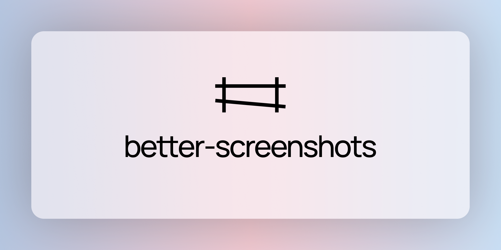

# Better Screenshots

<p align="center">
  
</p>

Screenshot tool with image and background customizations plus cloud uploads. 

---

- Configurable via TOML/JSON/YAML files with hot-reload support.
- Optional cloud hosting for uploading screenshots and generating shareable links.

**Philosophy**: Leverage existing tools (grim, slurp, scrot) for capture, focus on unique value (background customization, config-driven workflow).

---

## Features

### Capture Modes
- **Full screen** - Capture all monitors or single monitor (via grim)
- **Window** - Select and capture a specific window (via grim)
- **Region** - Interactive region selection (via slurp)
- **Delayed** - 3s, 5s, 10s countdown options

### Background Customization
- **Solid color** backgrounds
- **Gradient** backgrounds (with direction control)
- **Custom image** backgrounds
- **Frame/Border** styles (solid, rounded)
- **Shadow** depth and blur
- **Padding** around screenshot
- **Rounded corners** for background and screenshot
- **Preset templates** (Instagram, Twitter, blog-ready sizes)

### Output Options
- **Formats**: PNG, JPEG, WebP
- **Copy to clipboard**
- **Auto-save** with custom naming pattern

---

## Installation

### Prerequisites

```bash
# Wayland
grim          # Screenshot capture
slurp         # Region selection

# X11 (fallback)
scrot         # Screenshot capture

# Optional
wl-copy       # Clipboard (Wayland)
xclip         # Clipboard (X11)
```

### Install via SSH (All Linux Distros)

```bash
curl -sSL https://raw.githubusercontent.com/snhsish/better-screenshots/main/install.sh | sh
```

This script will:
- Download the latest binary
- Install to `~/.local/bin/better-screenshots`
- Check for required dependencies (grim, slurp)

---

### Nix Installation
-  Coming soon.

---

## Usage

```bash
# Capture with default settings from config
better-screenshots

# Override config options
better-screenshots capture --mode region --format png

# Full screen capture
better-screenshots capture --mode fullscreen

# Window capture
better-screenshots capture --mode window

# Delayed capture
better-screenshots capture --delay 5

# Use a preset
better-screenshots capture --preset "Instagram Post"

# Copy to clipboard only (don't save)
better-screenshots capture --clipboard-only

# Custom output path
better-screenshots capture --output ~/my-shot.png
```

### CLI Commands

```bash
# Show help
better-screenshots --help

# List available presets
better-screenshots presets

# Show config file path
better-screenshots config-path

# Create default config file
better-screenshots init-config
```

---

## Configuration

Config files are checked in this order (first found wins):
1. `~/.config/better-screenshots/config.toml`
2. `~/.config/better-screenshots/config.json`
3. `~/.config/better-screenshots/config.yaml`

Run `better-screenshots init-config` to create a default config file.

### TOML Config Structure

```toml
# ============================================
# CAPTURE SETTINGS
# ============================================
[capture]
default_format = "png"
save_directory = "~/Pictures/Screenshots"
naming_pattern = "screenshot_%Y%m%d_%H%M%S"
default_mode = "region"  # fullscreen, window, region
delay_seconds = 0

# ============================================
# BACKGROUND SETTINGS
# ============================================
[background]
default_type = "gradient"  # solid, gradient, image
default_color = "#1a1a2e"
padding = 32
shadow_enabled = true
shadow_blur = 20
shadow_offset_x = 0
shadow_offset_y = 10
shadow_color = "#000000"
frame_enabled = true
frame_width = 0
frame_color = "#ffffff"
frame_radius = 16
background_radius = 16

[background.gradient]
enabled = true
start_color = "#ff5858"
end_color = "#ffc8c8"
direction = "horizontal"  # vertical, horizontal, diagonal

[background.image]
enabled = false
path = "~/Pictures/bg.png"
fit = "cover"  # cover, contain, stretch
opacity = 1.0

# ============================================
# OUTPUT SETTINGS
# ============================================
[output]
jpeg_quality = 90
png_compression = 6
copy_to_clipboard = true
show_save_dialog = false

# ============================================
# CLOUD HOSTING
# ============================================
[cloud]
enabled = false
provider = "self_hosted"  # self_hosted, imgur, cloudinary, s3

[cloud.self_hosted]
api_url = "https://your-server.com/api"
api_key = ""

[cloud.third_party]
service = "imgur"
api_key = ""

[cloud.advanced]
auto_upload = false
copy_link_to_clipboard = true
delete_after_days = 30  # 0 = never

# ============================================
# PRESETS
# ============================================
[[presets]]
name = "Instagram Post"
width = 1080
height = 1080
background_type = "solid"
background_color = "#1a1a2e"
padding = 40

[[presets]]
name = "Twitter Image"
width = 1200
height = 675
background_type = "gradient"
gradient_start = "#1a1a2e"
gradient_end = "#16213e"
padding = 32
```

---

## Keybind Integration

Configure in your window manager (i3, Sway, etc.):

```bash
# Sway
bindsym $mod+Print exec better-screenshots capture --mode region
bindsym Print exec better-screenshots capture --mode fullscreen
```

---

## Tech Stack

| Component | Technology |
|-----------|------------|
| Language | Python 3.10+ |
| CLI Framework | click |
| Capture | Native `grim` (Wayland) / `scrot` (X11) |
| Region select | `slurp` |
| Image processing | Pillow (PIL) |
| Config parsing | `toml`, `yaml` |
| HTTP client | `requests` |

---

## License

MIT
